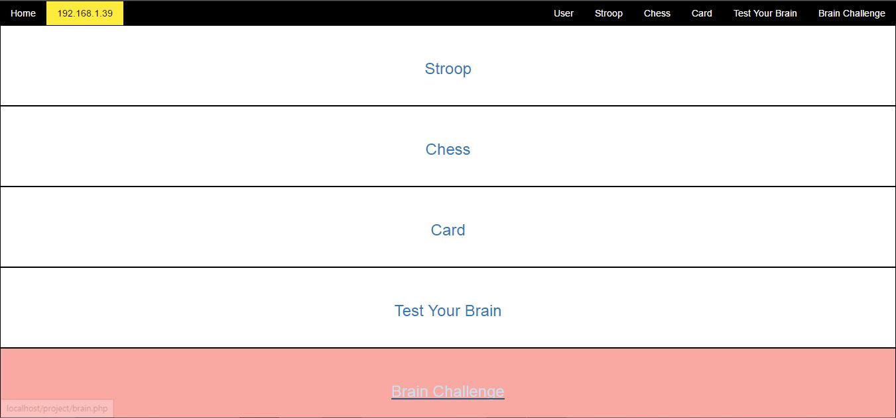
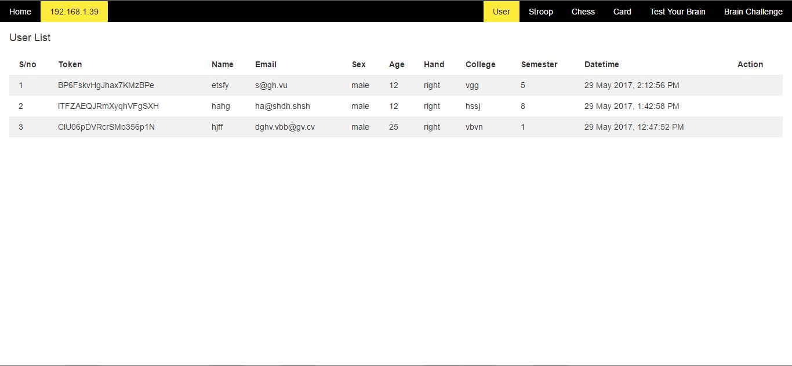
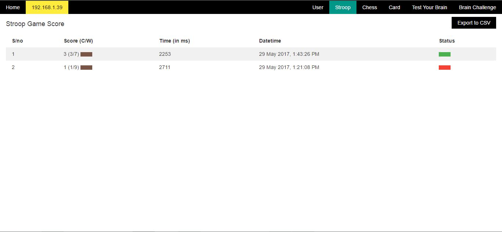
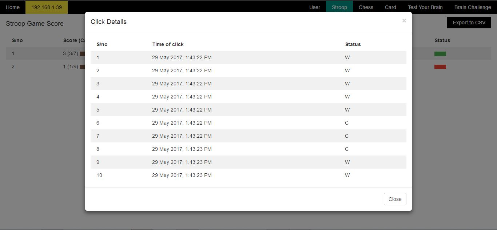

## Snapshot of server side admin dashboard

* **Home Page** : This is the admin dashboard page where you can see all the game list.

* **User Page** : Admin can see all the registered user and their detail in one page. We are not showing user name because of some security reason.

* **Test your brain Page** : Test your brain is one game, and it has 5 levels. all the score is listed here in a very organise manners.there is score(correct/wrong) for each level in different column. There is status which indicates whether this score is active or inactive. green is for active and red for inactive. There is brown indicator with every score.

* **Stroop Page** : Stroop is another game, which score is listed here.

* **Stroop Score detail Modal** : In any game, there is score and there is brown indicators, if we click on that indicators, then it will show a popup and it will show at what time what was happening. in this given picture, there are 10 question. user has clicked at given time, and at that time, what was the response, whether it was correct or wrong.

